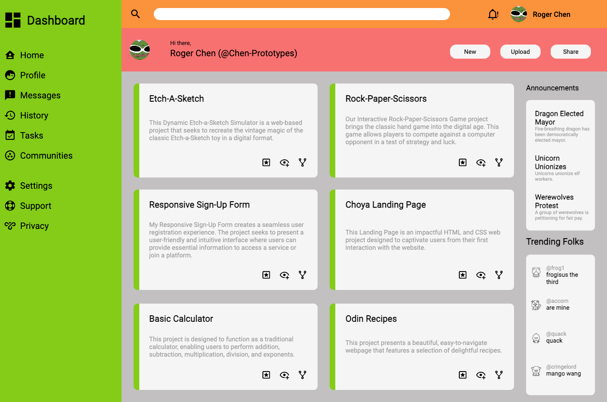

# admin-dashboard

## [Live Demo](https://chen-prototypes.github.io/admin-dashboard/)

This is a project from [Odin Project](https://www.theodinproject.com/lessons/node-path-intermediate-html-and-css-admin-dashboard). The icons are from [Pictogrammer Material Design Icons](https://pictogrammers.com/library/mdi/). My profile loco is from a [Cool Zone Pepe](https://www.google.com/search?q=pepe+cool+zone&sxsrf=APwXEdf7TdPZVVpE4OoauRk-r-VJKu4Jxw:1687882848319&source=lnms&tbm=isch&sa=X&ved=2ahUKEwj8heLM7eP_AhV2ATQIHT-TDqcQ0pQJegQIARAC&biw=887&bih=1001&dpr=1#imgrc=lvsHbDEjYHLBxM).

Over all the project was good, my color palette looks pretty bad but I kinda like the watermelon aesthetic.
